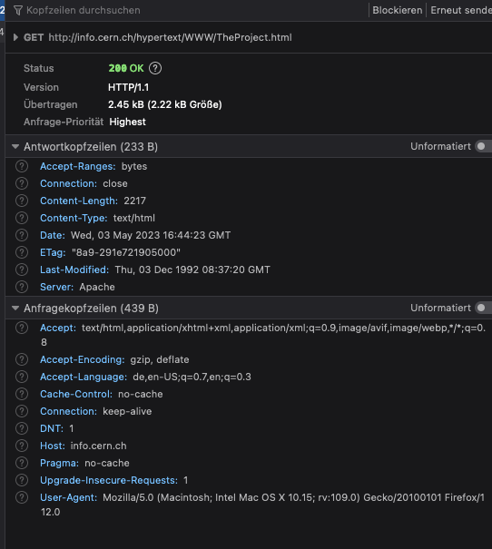
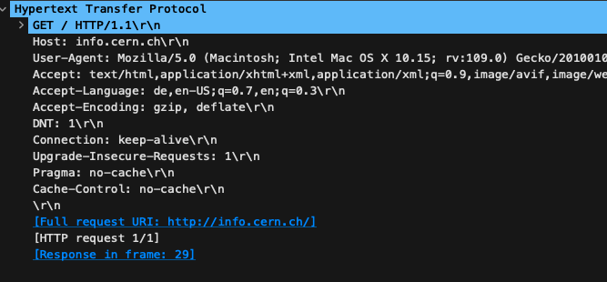
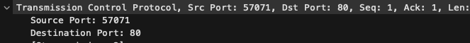
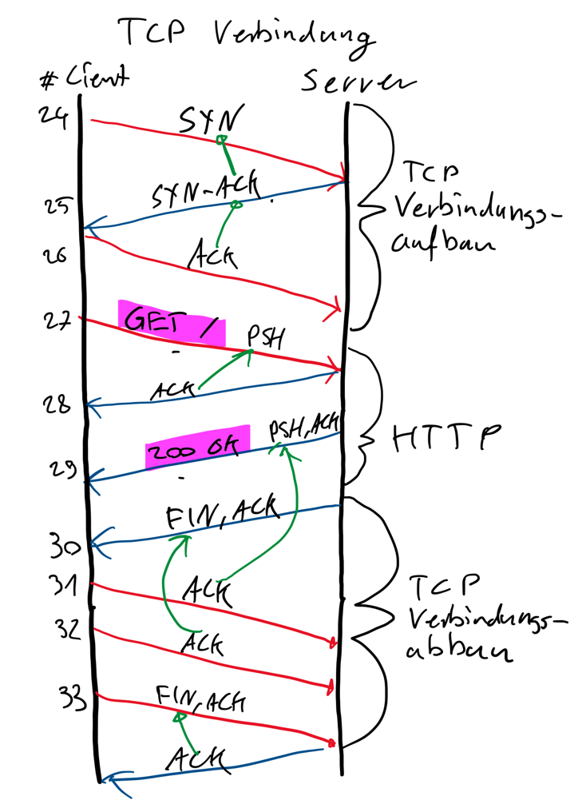
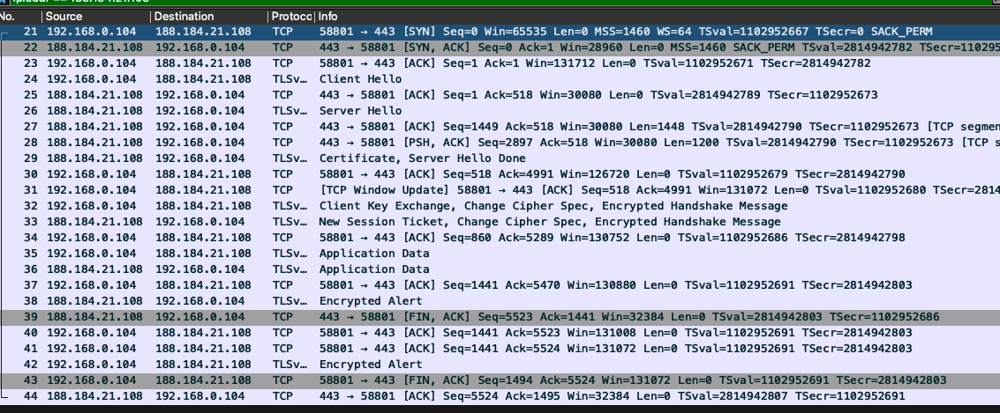

# Praktikum HTTP - Lösungen
## Browsertools
### Fragen und Aufgaben
- Welche HTTP Methode wurde verwendet?

`HTTP/1.1`

- Mit welchem HTTP Statuscode hat der Server geantwortet? Was bedeutet dieser?

`200 OK` Dies bedeutet, dass die Anfrage erfolgreich war und das gewünschte Dokument im Payload vorhanden ist.

- Wie kann ein Statuscode >=400 provoziert werden? Was bedeutet dies?

Wenn z.B. eine URL angefragt wird, die auf dem Server nicht existiert: `http://info.cern.ch/foo`. In dem Fall antwortet der Server mit `404 Not Found`, d.h. die gewünschte Seite wurde nicht gefunden.

- Wird die TCP Verbindung offen gehalten oder geschlossen?

Der Client wünscht zwar, dass die Verbindung offen gehalten wird `Connection: keep-alive`, doch der Server schliesst die Verbindung nach der Übertragung (`Connection: close`).
Da für die ganze Seite nur zwei Dateien übertragen wurden, ist das auch kein Problem.

- Welche Datentypen akzeptiert der Browser?

`text/html,application/xhtml+xml,application/xml;q=0.9,image/avif,image/webp`
d.h.: (x)html seiten, xml dokumente, avif und webp bilder.

## Wireshark
### Fragen und Aufgaben
- Untersuche die Request und Response Header. Erkläre die einzelnen Bestandteile der Header und deren Bedeutung.

`GET / HTTP/1.1\r\n`: Die verwendete HTTP Methode ist `GET`, angefragt wird das Wurzelverzeichnis `/` und es soll die Protokollversion 1.1 verwendet werden.
`Host`: Der angeforderte Host ist `info.cern.ch`
`User-Agent`: Dies bezeichnet den verwendeten Browser des Clients, hier Firefox auf MacOS
`Accept`: Die Datei-Arten, die der Client verarbeiten kann.
`Accept-Language`: Die gewünschte Sprache des Inhalts.
`Accept-Encoding`: Die Codierung des Dokuments, die der Client verarbeiten kann
`Connection`: Ob die TCP Verbindung nach dem verschicken des ersten Dokuments geschlossen werden soll oder nicht.

Siehe auch die Doku auf [mdn web docs](https://developer.mozilla.org/en-US/docs/Web/HTTP).

- Über welche Sockets läuft die Verbindung?

Beim Server wird der HTTP Standartport `80` verwendet. Beim Client ist dem Browser der Port `57071` zugeteilt.
Die Sockets (die Kombination von Port und IP) sind also:
Client: `192.168.0.104:57071`
Server: `188.184.21.201:80`

- Skizziere die TCP Verbindung der ersten HTTP-Anfrage.

- Was Ändert sich in der Wireshark Aufzeichnungm, wenn eine Seite über HTTPS aufgerufen wird?

Die Daten des HTTP Protokolls sind nicht mehr sichtbar, da sie in den TLS Paketen verschlüsselt verschickt werden.

## PyCharm HTTP Client
### Fragen und Aufgaben
- Experimentiere mit den Header Feldern. Welche Werte können gesetzt werden? Wie reagiert der Server?

## cURL, wget
- Erstelle dieselbe HTTP Anfrage auch mit den CLI Programmen `cURL` und `Wget`.
- Speichere die Website in einer Datei.

`curl -o info.cern.ch.html info.cern.ch`
`wget info.cern.ch`