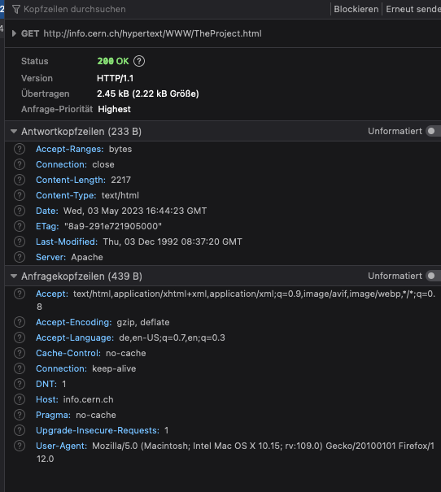
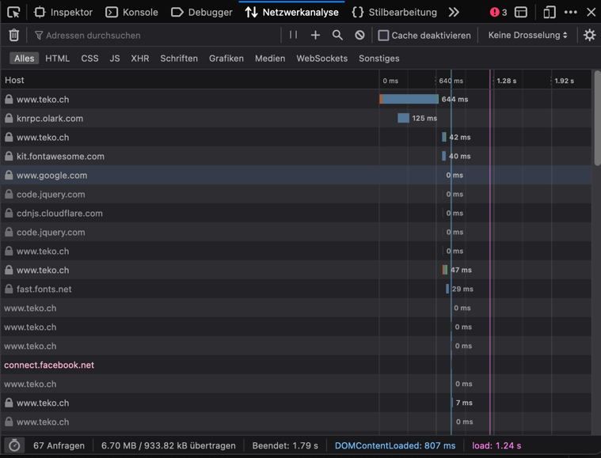

# Praktikum HTTP - Lösungen
## Browsertools
### Fragen und Aufgaben
- Welche HTTP Methode wurde verwendet?

`HTTP/1.1`

- Mit welchem HTTP Statuscode hat der Server geantwortet? Was bedeutet dieser?

`200 OK` Dies bedeutet, dass die Anfrage erfolgreich war und das gewünschte Dokument im Payload vorhanden ist.

- Wie kann ein Statuscode >=400 provoziert werden? Was bedeutet dies?

Wenn z.B. eine URL angefragt wird, die auf dem Server nicht existiert: `http://info.cern.ch/foo`. In dem Fall antwortet der Server mit `404 Not Found`, d.h. die gewünschte Seite wurde nicht gefunden.

- Wird die TCP Verbindung offen gehalten oder geschlossen?

Der Client wünscht zwar, dass die Verbindung offen gehalten wird `Connection: keep-alive`, doch der Server schliesst die Verbindung nach der Übertragung (`Connection: close`).
Da für die ganze Seite nur zwei Dateien übertragen wurden, ist das auch kein Problem.

- Welche Datentypen akzeptiert der Browser?

`text/html,application/xhtml+xml,application/xml;q=0.9,image/avif,image/webp`
d.h.: (x)html seiten, xml dokumente, avif und webp bilder.

## Wireshark
### Fragen und Aufgaben
- Untersuche die Request und Response Header. Erkläre die einzelnen Bestandteile der Header und deren Bedeutung.

`GET / HTTP/1.1\r\n`: Die verwendete HTTP Methode ist `GET`, angefragt wird das Wurzelverzeichnis `/` und es soll die Protokollversion 1.1 verwendet werden.
`Host`: Der angeforderte Host ist `info.cern.ch`
`User-Agent`: Dies bezeichnet den verwendeten Browser des Clients, hier Firefox auf MacOS
`Accept`: Die Datei-Arten, die der Client verarbeiten kann.
`Accept-Language`: Die gewünschte Sprache des Inhalts.
`Accept-Encoding`: Die Codierung des Dokuments, die der Client verarbeiten kann
`Connection`: Ob die TCP Verbindung nach dem verschicken des ersten Dokuments geschlossen werden soll oder nicht.

Siehe auch die Doku auf [mdn web docs](https://developer.mozilla.org/en-US/docs/Web/HTTP).

- Über welche Sockets läuft die Verbindung?

Beim Server wird der HTTP Standartport `80` verwendet. Beim Client ist dem Browser der Port `57071` zugeteilt.
Die Sockets (die Kombination von Port und IP) sind also:
Client: `192.168.0.104:57071`
Server: `188.184.21.201:80`

- Skizziere die TCP Verbindung der ersten HTTP-Anfrage.

- Was Ändert sich in der Wireshark Aufzeichnungm, wenn eine Seite über HTTPS aufgerufen wird?

Die Daten des HTTP Protokolls sind nicht mehr sichtbar, da sie in den TLS Paketen verschlüsselt verschickt werden.

## cURL, wget
- Erstelle dieselbe HTTP Anfrage auch mit den CLI Programmen `cURL` und `Wget`.
- Speichere die Website in einer Datei.

`curl -o info.cern.ch.html info.cern.ch`
`wget info.cern.ch`

## HTTP/2, Cache und Cookies
### Fragen und Aufgaben
- Untersuche die Kommunikation bei ein- bzw. ausgeschaltetem Cache. Siehst du einen Unterschied?

Mit eingeschaltetem Cache sind viele Abfragen mit 0ms Dauer sichtbar. 
Das sind die Dateien, die aus dem Cache geladen wurden.
Unten links ist ersichtlich, dass mit Cache von den rund 7MB Gesamtgrösse nur etwa 1MB geladen wurde.
Der Rest wurde aus dem Cache geladen.

Ohne Cache verschwinden die 0ms dauernden Abfragen und die geladene Dateigrösse wird grösser.

Wenn man die durchschnittlichen Ladezeiten (`load` unten rechts) vergleicht, sieht man, dass der Cache keinen relevanten Einfluss hat.
Die durchschnittlichen Ladezeiten unterscheiden sich kaum.

Wir hingegen die Geschwindigkeit gedrosselt treten die Geschwindigkeitsvorteile des Caches deutlicher hervor:

|         | mit Cache | ohne Cache |
|---------|-----------|------------|
| Good 3G | 10s       | 14s        |
| Good 2G | 24s       | 46s        |

- HTTP/2 verspricht höhere Geschwindigkeiten im Vergleich zu HTTP/1.1. HTTP/3 soll diese weiter steigern. Erstelle eine kleine Statistik, um dies zu überprüfen.
Über 9 Dateien ist von HTTP/1.1 zu HTTP/2 ein kleiner Geschwindigkeitsvorteil sichtbar, HTTP/3 hingegen ist hier deutlich langsamer.
Es ist davon auszugehen, dass andere Einflussfaktoren hier eine deutlich grössere Rolle spielen als das verwendete Protokoll.

- Untersuche die gespeicherten Cookies. Versuche herauszufinden, wozu diese dienen.
- Cookies werden oft genutzt, um den Login Zustand zu speichern. Untersuche, was passiert, wenn du die Cookies löscht. Mit welchem Cookie wird der Login-Zustand gespeichert? Wie funktioniert dies?
Mit dem Cookie `PHPSESSID` wird die Login Session identifiziert. 
Anhand von dieser ID identifiziert der Server den eingeloggten User. Wird dieses Cookie gelöscht, ist man nicht mehr eingeloggt.
Weil Cookies im Browser gespeichert werden und dadurch vom User editiert werden können, wird der Login Zustand aus Sicherheitsgründen nicht im Cookie festgehalten.
Die Session ID ist eine sehr grosse, zufällig generierte Zahl, damit andere Session IDs nicht erraten werden können.
