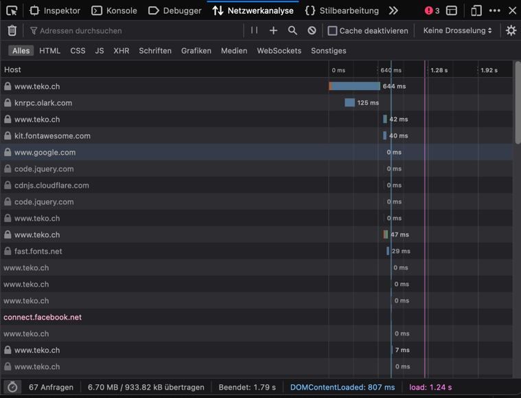
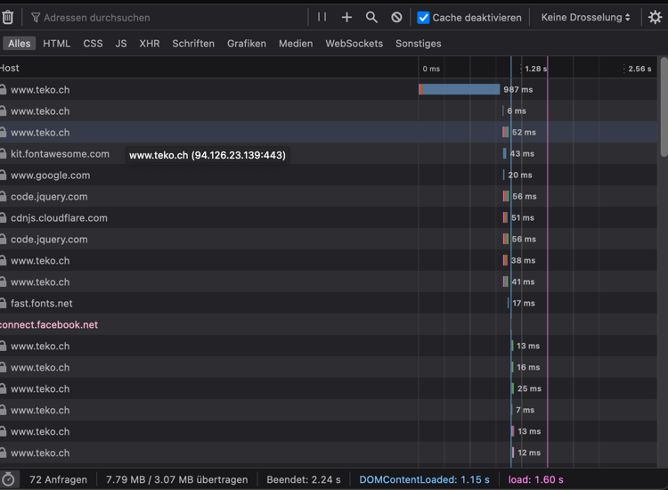

# Praktikum HTTP und REST
## HTTP/2, Cache und Cookies
### Fragen und Aufgaben
- Untersuche die Kommunikation bei ein- bzw. ausgeschaltetem Cache. Siehst du einen Unterschied?

Mit eingeschaltetem Cache sind viele Abfragen mit 0ms Dauer sichtbar. 
Das sind die Dateien, die aus dem Cache geladen wurden.
Unten links ist ersichtlich, dass mit Cache von den rund 7MB Gesamtgrösse nur etwa 1MB geladen wurde.
Der Rest wurde aus dem Cache geladen.

Ohne Cache verschwinden die 0ms dauernden Abfragen und die geladene Dateigrösse wird grösser.

Wenn man die durchschnittlichen Ladezeiten (`load` unten rechts) vergleicht, sieht man, dass der Cache keinen relevanten Einfluss hat.
Die durchschnittlichen Ladezeiten unterscheiden sich kaum.

Wir hingegen die Geschwindigkeit gedrosselt treten die Geschwindigkeitsvorteile des Caches deutlicher hervor:

|         | mit Cache | ohne Cache |
|---------|-----------|------------|
| Good 3G | 10s       | 14s        |
| Good 2G | 24s       | 46s        |

- HTTP/2 verspricht höhere Geschwindigkeiten im Vergleich zu HTTP/1.1. HTTP/3 soll diese weiter steigern. Erstelle eine kleine Statistik, um dies zu überprüfen.
Über 9 Dateien ist von HTTP/1.1 zu HTTP/2 ein kleiner Geschwindigkeitsvorteil sichtbar, HTTP/3 hingegen ist hier deutlich langsamer.
Es ist davon auszugehen, dass andere Einflussfaktoren hier eine deutlich grössere Rolle spielen als das verwendete Protokoll.

- Untersuche die gespeicherten Cookies. Versuche herauszufinden, wozu diese dienen.
- Cookies werden oft genutzt, um den Login Zustand zu speichern. Untersuche, was passiert, wenn du die Cookies löscht. Mit welchem Cookie wird der Login-Zustand gespeichert? Wie funktioniert dies?
Mit dem Cookie `PHPSESSID` wird die Login Session identifiziert. 
Anhand von dieser ID identifiziert der Server den eingeloggten User. Wird dieses Cookie gelöscht, ist man nicht mehr eingeloggt.
Weil Cookies im Browser gespeichert werden und dadurch vom User editiert werden können, wird der Login Zustand aus Sicherheitsgründen nicht im Cookie festgehalten.
Die Session ID ist eine sehr grosse, zufällig generierte Zahl, damit andere Session IDs nicht erraten werden können.

## REST
- Untersuche die Antwort und wie du mit der Anfrage die Antwort beeinflussen kannst.
- Vergleiche die Endpunkte und die Antwort mit der REST Theorie. Wo entspricht die API den REST Prinzipien, wo nicht?
