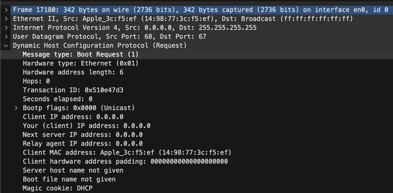
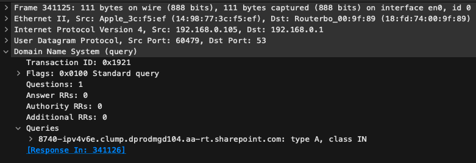
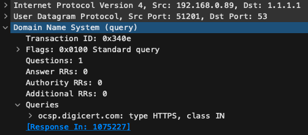

# Praktikum Konfiguration - Lösungen

## Aufgabenstellung
### DHCP und NAT
Untersuche mit Wireshark eine DHCP Kommunikation und beantworte folgende Fragen:
- Welche IP-Adresse wurde vergeben?

_Zuerst wird der Request geschickt. 
Dieser wird als Broadcast verschickt, also an alle Geräte im Netzwerk.
Weil der Host in diesem Moment noch nicht konfiguriert ist, "weiss" der Host auch nicht, welche Adresse der DHCP Server hat.

Dann antwortet der Server:

Diese Nachricht ist nun Unicast an die neue IP und die MAC Adresse des Hosts. 
Über die Transaction ID wird der Nachrichtenaustausch identifiziert, sie ist in der Antwort gleich wie in der Anfrage.
Es wird die Adresse `192.168.0.105` konfiguriert._

- In welchem Subnetz befindet sich die IP? Ist dies ein privates oder öffentliches Netz?

_Die Subnetzmaske wird auf `255.255.255.0` gesetzt, d.h. Subnetz ist `192.168.0.0/24`._

- Welches Default Gateway wurde konfiguriert?

_Das default Gateway, bzw Router wurde auf `192.168.0.1` gesetzt._

- Welche DNS-Server wurden konfiguriert? Wieso werden oft mehrere DNS-Server konfiguriert?

_Die konfigurierten DNS-Server sind: `192.168.0.1`, `213.144.129.20`, `77.109.128.2`.
Der erste DNS-Server ist der lokale Router, dieser agiert als DNS-Cache._

- Wie ist deine öffentliche IP-Adresse?

_Z.B. auf [https://whatismyipaddress.com/](https://whatismyipaddress.com/) kann die öffentliche IP angezeigt werden, da diese lokal nicht sichtbar ist, bzw. nur in der Router-Konfiguration einsehbar ist.
Dies weil die IPv4 `192.168.0.105` eine private IP ist.
Diese wird vom Router nicht ins Internet geroutet, sondern dort mit NAT in eine öffentliche IP, die vom ISP zugewiesen wurde übersetzt.
So haben alle Hosts im lokalen Netz dieselbe öffentliche IPv4.
Hier ist sie `85.195.235.11`_

Untersuche die Netzwerkkonfiguration von deinem Gerät mit `ifconfig` (macOS, Linux), `ipconfig` (Windows):
- Über welche Netzwerkinterfaces verfügt dein Gerät? Identifiziere die Hardware- sowie WLAN-Schnittstelle.

_Die Ausgabe vo `ifconfig` ist auf macOS sehr lang. Unter anderem sind folgende Interfaces sind verfügbar:
- `lo0`: Loopback, Localhost. Interface für das eigene Gerät.
- `en0`: Ethernet Hardware-Schnittstelle
- `en1`: WLAN-Schnitstelle
- `gif0`: Software Network Interface
- `stf0`: 6to4 tunnel interface
- `utun0`: Genutzt für "Find My..."_

- Welche MAC Adresse haben die Schnittstellen?

`en0`: Beginnt mit `14:98`
- Welche IPv4 und IPv6 ist auf diesen Schnittstellen konfiguriert?

_`192.168.0.105`, `fe80::420:dc35:561d:cb44` 
Die IPv6 Adresse ist eine link-local Adresse, d.h. der host hat diese selber konfiguriert.
Bei IPv6 ist DHCP nicht nötig, da der Host sich die link-local Adresse selber gibt und dann mit dieser Adresse mit dem Router eine neue Adresse aushandelt, mit der er dann mit anderen Geräten kommunizieren kann.
Dies ist hier nicht geschehen._

- Welches Subnetz ist konfiguriert?

_IPv4: `192.168.0.0/24`_

- Kannst du die IPv4 und IPv6 Adresse manuell ändern? Was musst du berücksichtigen, dass du noch Internetzugriff hast?

_Dies kann in den Systemeinstellungen gemacht werden. Es muss sichergestellt werden, dass die IP nicht schon vergeben ist, und dass sich die IP im selben Subnetz befindet.
Hier musss sie mit `192.168.0` beginnen.
Hier ist der DHCP-Server so konfiguriert, dass nur Host-Adressen im Bereich ovn 100-200 vergeben werden.
Für fixe IPs steht so der Bereich von `192.168.0.2` bis `192.168.0.99` zur Verfügung._

### DNS
Untersuche mit Wireshark eine DNS Kommunikation und beantworte folgende Fragen.
DNS Auflösungen werden im Client zwischengespeichert, stelle deshalb sicher, dass die Aufzeichnung mindestens 10min läuft.

_Query:_

_Response:_

- Welcher DNS-Server hat geantwortet? Wer betreibt diesen Server?

_Bei der Response Nachricht ist auf dem IP-Layer der Absender (`192.168.0.1`) sichtbar.
Es hat also der Router mit einer DNS Anfrage geantwortet._

- Welchen Typ hat die DNS Nachricht?

Es sind einerseits `CNAME` Einträge vorhanden, andererseits `A` Einträge.
Die `CNAME` mappen Domainnamen auf Domainnamen, hier z.B. `8740-ipv4v6e.clump.dprodmgd104.aa-rt.sharepoint.com` auf `190171-ipv4v6e.farm.dprodmgd104.aa-rt.sharepoint.com`
Die Type `A` Einträge mappen dann einen Domainnamen auf eine IP, hier `dual-spo-0003.spo-msedge.net` auf `13.107.136.8`
- Welche IP hat der Host?
`13.107.136.8` und `13.107.138.8`

- Kannst du den DNS-Server für deinen Client auf einen öffentlichen ändern (z.B. 1.1.1.1 (cloudflare), 8.8.8.8 (google))?

_Unter macOS muss dazu die IP manuell konfiguriert werden.
Anschliessend können manuell DNS-Server konfiguriert werden._

