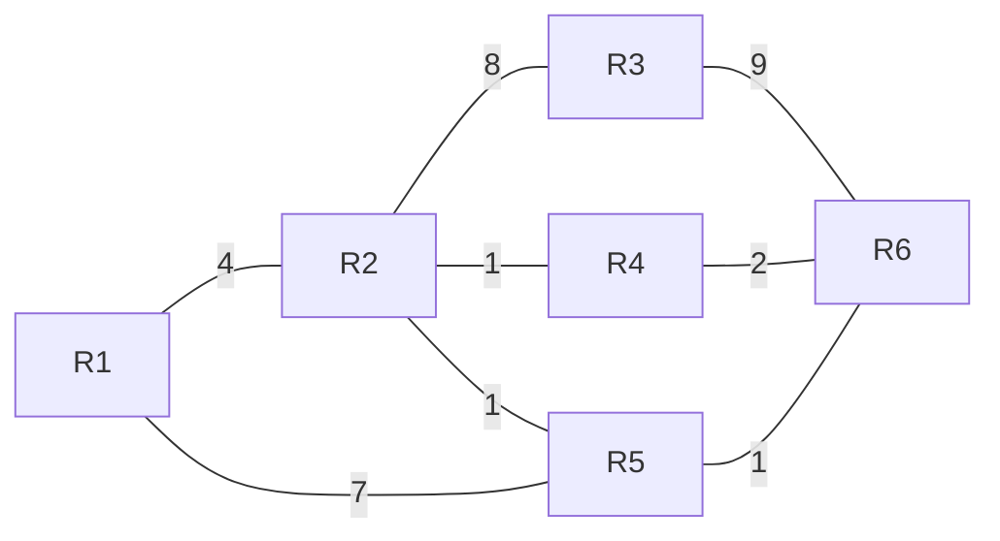

# Übung Network Layer

## Lernziele

- Die Studierenden wissen, wie Router funktionieren und wie sie im Verbund das globale Zustellen von IP-Paketen
  ermöglichen.
- Die Studierenden sind vertraut mit IPv4 und IPv6 Adressierung und CIDR Subnetting.

## Aufgabenstellung

Zum Erreichen der Lernziele sollte die erste Aufgabe vollständig gelöst werden.

Die Antworten sollen in einem kurzen Bericht festgehalten werden. Dieser dient den anderen Studierenden als Handout (
Format: PDF).

Versuche möglichst strukturiert vorzugehen:

1. **These:** Formuliere eine Fragestellung, die du untersuchen möchtest.
2. **Experiment:** Entwerfe ein Vorgehen, mit dem du die Fragestellung beantworten kannst und führe diesen Plan aus.
   Halte die Ergebnisse fest.
3. **Diskussion:** Beantworte die Fragestellung.
4. **Ausblick:** Halte offene Fragen fest.
5. **Iteration:** Wiederhole bei offenen Fragen den Prozess.

### Data Plane

Nutze den beiliegenden Code, um ein simuliertes Netzwerk von Routern aufzubauen.

Orientiere dich dafür am Test ([TestRouter.py](TestRouter.py)).

Implementiere folgende Struktur oder wähle eine Eigene:

1. Konfiguriere die Routing Tabellen so, dass Nachrichten auf dem schnellsten Weg von `R1` zu `R6` geroutet werden. Die
   Zahlen auf den Verbindungen sind ein Mass für die Übertragungsgeschwindigkeit. Überprüfe den Weg der Nachrichten,
   indem du in jedem Router bei der Weiterleitung loggst.
2. Überprüfe im Router die Protokollversion des Packets und ob es noch gültig ist (`TTL`, `Hop Limit`).
3. Ändere die Weiterleitung so, dass Subnetze in die forwarding table eingetragen werden können.
4. Erweitere die Ports mit Buffern in denen Nachrichten an den Port (`send_in`, `send_out`) gespeichert werden. Versende
   die Nachrichten in den Puffern in regelmässigen Abständen. Untersuche nun, wie die Nachrichten durch das Netzwerk
   geleitet werden.

### Control Plane

1. Versehe die Verbindungen zwischen den Routern mit Gewichten. Entwickle oder Implementiere ein Protokoll, das die
   optimale Route zwischen zwei Routern berechnet.