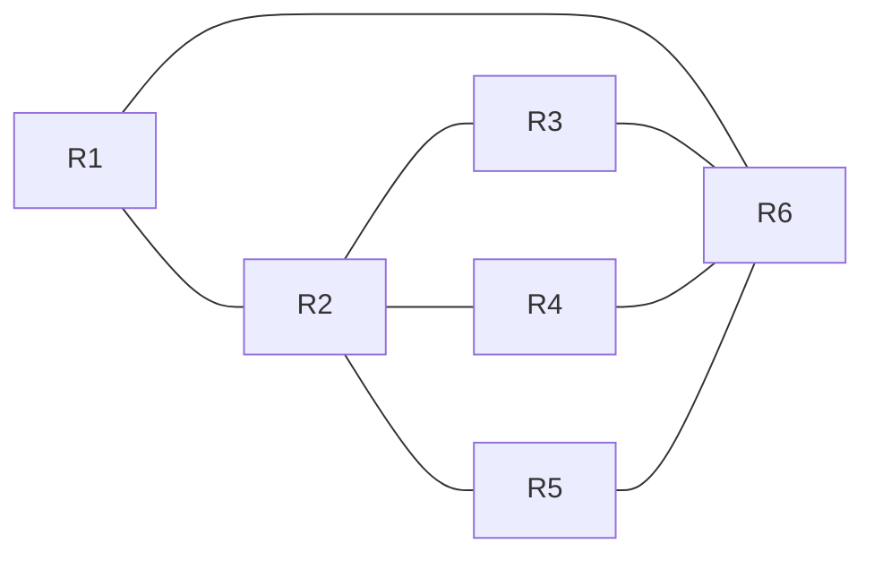

# Übung Network Layer

## Lernziele

- Die Studierenden kennen die Internetprotokolle HTTP, DNS, TCP, UDP, IP und verstehen deren Funktionsweise.
- Die Studierenden sind vertraut mit IPv4 und IPv6 Adressierung und NAT sowie der Konfiguration mit DHCP und Stateless
  Address Autoconfiguration bei IPv6.

## Aufgabenstellung

Zum Erreichen der Lernziele sollten ???? vollständig gelöst werden.

Die Antworten sollen in einem kurzen Bericht festgehalten werden.
Dieser dient den anderen Studierenden als Handout (Format: PDF).

Versuche möglichst strukturiert vorzugehen:

1. **These:** Formuliere eine Fragestellung, die du untersuchen möchtest.
2. **Experiment:** Entwerfe ein Vorgehen, mit dem du die Fragestellung beantworten kannst und führe diesen Plan aus.
   Halte die Ergebnisse fest.
3. **Diskussion:** Beantworte die Fragestellung.
4. **Ausblick:** Halte offene Fragen fest.
5. **Iteration:** Wiederhole bei offenen Fragen den Prozess.

### Data Plane

Nutze den beiliegenden Code ([Router.py](Router.py)) um ein simuliertes Netzwerk von Routern aufzubauen.

Implementiere folgende Struktur oder wähle eine eigene:

1. Konfiguriere die Routing Tabellen so, dass Nachrichten von R1 zu R6 geroutet werden. Überprüfe den Weg der
   Nachrichten mit Logging.
2. Ändere die Weiterleitung so, dass nur ein Präfix des Ziels in die Routingtabelle eingetragen werden kann. Z.B. für
   die Adresse `110100`:

| Prefix | Port |
|--------|------|
| 110    | 0    |

3. Erweitere die Ports mit Buffern in denen Nachrichten an den Port (`send_in`, `send_out`) gespeichert werden. Versende
   die Nachrichten in den Puffern in regelmässigen Abständen. Untersuche nun, wie die Nachrichten durch das Netzwerk
   geleitet werden.

### Control Plane

1. Versehe die Verbindungen zwischen den Routern mit Gewichten. Entwickle ein Protokoll, das die optimale Route zwischen
   zwei Routern berechnet.