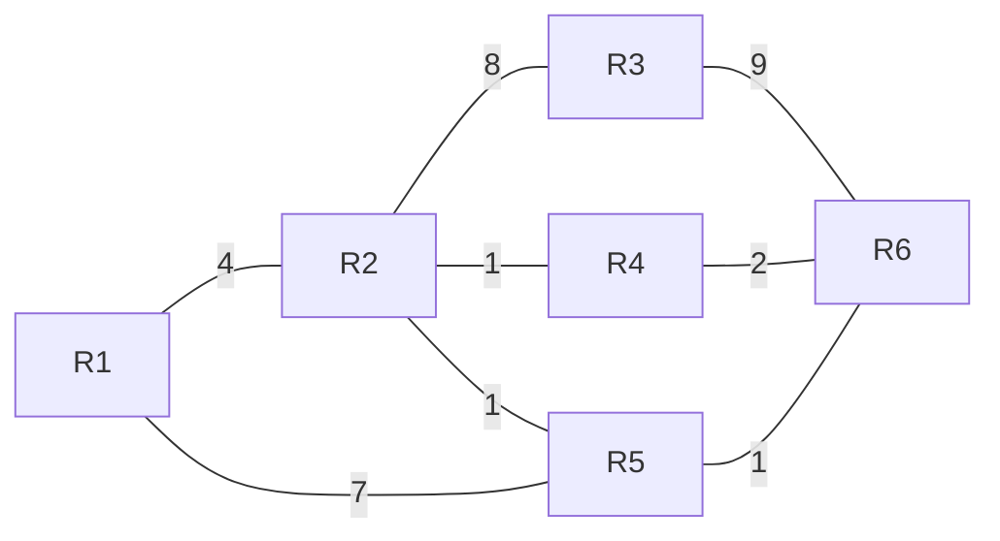

# Übung Network Layer

## Lernziele

- Die Studierenden kennen die Internetprotokolle HTTP, DNS, TCP, UDP, IP und verstehen deren Funktionsweise.
- Die Studierenden sind vertraut mit IPv4 und IPv6 Adressierung und NAT sowie der Konfiguration mit DHCP und Stateless
  Address Autoconfiguration bei IPv6.

## Aufgabenstellung

Zum Erreichen der Lernziele sollte die erste Aufgabe vollständig gelöst werden.

Die Antworten sollen in einem kurzen Bericht festgehalten werden.
Dieser dient den anderen Studierenden als Handout (Format: PDF).

Versuche möglichst strukturiert vorzugehen:

1. **These:** Formuliere eine Fragestellung, die du untersuchen möchtest.
2. **Experiment:** Entwerfe ein Vorgehen, mit dem du die Fragestellung beantworten kannst und führe diesen Plan aus.
   Halte die Ergebnisse fest.
3. **Diskussion:** Beantworte die Fragestellung.
4. **Ausblick:** Halte offene Fragen fest.
5. **Iteration:** Wiederhole bei offenen Fragen den Prozess.

### Data Plane

Nutze den beiliegenden Code ([Router.py](Router.py)) um ein simuliertes Netzwerk von Routern aufzubauen.

Implementiere folgende Struktur oder wähle eine eigene:

1. Konfiguriere die Routing Tabellen so, dass Nachrichten auf dem schnellsten Weg von `R1` zu `R6` geroutet werden. Die
   Zahlen auf den Verbindungen sind ein Mass für die Übertragungsgeschwindigkeit.
   Überprüfe den Weg der Nachrichten mit Logging.
2. Implementiere einen Parser, der `IPv4` oder `IPv6` Pakete in ein Message-Objekt übersetzt. Überprüfe die Protokollversion
   und ob das Paket noch gültig ist (`TTL`, `Hop Limit`) und extrahiere die Ziel-Adresse.
3. Ändere die Weiterleitung so, dass IP-Adressen (inkl. Host-Teil) mit den Einträgen in der Routing Tabelle verglichen
   werden.
4. Erweitere die Ports mit Buffern in denen Nachrichten an den Port (`send_in`, `send_out`) gespeichert werden. Versende
   die Nachrichten in den Puffern in regelmässigen Abständen. Untersuche nun, wie die Nachrichten durch das Netzwerk
   geleitet werden.

### Control Plane

1. Versehe die Verbindungen zwischen den Routern mit Gewichten. Entwickle oder Implementiere ein Protokoll, das die
   optimale Route zwischen zwei Routern berechnet.