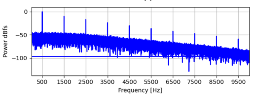

# Übung Grundlagen

Belege alle deine Antworten mit **Quellen**!

Visualisiere wenn möglich deine Antworten!

## Überblick

Lies folgenden Artikel aufmerksam durch. Halte den Inhalt stichwortartig fest und notiere dir Punkte, die du nicht 
verstehst: [Wenn die Nachbarn früher jubeln: Die Fussball-TV-Hölle](https://blog.init7.net/de/wenn-die-nachbarn-frueher-jubeln-die-fussball-tv-hoelle/)

Versuche anschliessend in der Gruppe die nicht bekannten Punkte zu klären und bearbeite folgende Fragen:

- Skizziere den Weg des Signals vom Stadion bis zum heimischen TV.
- Was bedeutet Encoding bzw Codierung?
- Wie unterscheiden sich Ethernet und WLAN bezüglich Übertragungsstörungen? Wieso?
- Wozu dient Komprimierung?
- Der Artikel spricht von "Bandbreite". Welcher Fachbegriff wäre hier korrekt? Und was ist die eigentliche Bedeutung 
  von Bandbreite?
- Was sind die Eigenschaften von Koaxialkabel?
- Wieso wird immer mehr IP basierte Übertragung genutzt? Welche Vor- und Nachteile hat das?

## Zeit- und Frequenzbereich

Folgende Abbildung zeigt ein Signal im Zeitbereich. 

- Skizziere die Darstellung des Signals im Frequenzbereich.

Folgende Abbildung zeigt ein Signal im Frequenzbereich. 

- Skizziere die Darstellung des Signals im Zeitbereich.
- Wie gross ist der Störabstand (SNR)?
- Wie gross ist die Bandbreite des Signals?
- Wieso wird die Leistung in dB angegeben?

## Bandbreite

Erstelle eine Tabelle, in der du verschiedene Protokolle nach der verfügbaren Bandbreite ordnest.

Halte ebenfalls den Übertragungskanal fest (Funk, Twisted Pair, Koaxial, Glasfaser)

Funkprotokolle teilen den [zugewiesenen Frequenzbereich](https://www.bakom.admin.ch/bakom/de/home/frequenzen-antennen/nationaler-frequenzzuweisungsplan.html) oftmals in Kanäle auf. 
Gib hier die Bandbreite pro Kanal an.

- DVB 
- WLAN IEEE 802.11a
- WLAN IEEE 802.11ac
- ADSL2+
- DOCSIS
- Gigabit Ethernet 1000BASE-T
- 10G Ethernet 10GBASE-LR

Also z.B.:

| Protokoll        | Bandbreite | Übertragungskanal |
|------------------|------------|-------------------|
| DAB  (Pro Kanal) | 7 MHz      | Funk              |

## Nachrichtenquader

Erstelle drei Diagramme für die drei wichtigen Übertragungsmedien Kupfer, Glasfaser und Funk.
Die X-Achse bezeichnet die Bandbreite, die Y-Achse den Störabstand des Kanals:

Zeichne in diese drei Diagramme nun jeweils eine Fläche ein, die den verfügbaren Störabstand und Bandbreite des 
Übertragungskanals darstellt.
Die exakten numerischen Werte sind dabei zweitrangig, wichtig ist das Verhältnis der drei Kanäle.

## Digitale und Analoge Signale

Digitalisiere folgendes Signal mit einer Abtastrate von 200Hz und einer Bittiefe von 2Bit: 

Skizziere die digitalen Abtastpunkte.