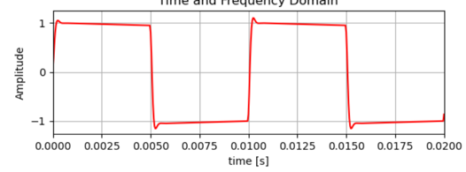

# Übung Quellencodierung

## Schallwandler

Speise einen Lautsprecher mit einem Signal aus dem Funktionsgenerator.

Untersuche mit dem Oszilloskop die Spannung am Ausgang vom Mikrofon welches auf den Lautsprecher ausgerichtet ist.

Untersuche auch den digitalen Ausgang am Interface.

## Digitale und Analoge Signale

Skizziere, wie folgendes Signal mit einer Abtastrate von 200Hz und einer Bittiefe von 2Bit digitalisiert wird:

## AD-Wandlung

Die beiden wichtigsten Kennwerte der Digital-Analog-Wandlung sind Bitrate und Abtastrate (engl. sampling rate).
Die Abtastrate bestimmt nach dem Nyquist-Shannon-Abtasttheorem die maximal im Signal vorkommende Frequenz.
Die Bitrate hingegen bestimmt den möglichen Störabstand, da die Quantisierung Rauschen verursacht.
Der resultierende Störabstand ist proportional zur verwendeten Bit-Tiefe n:

`Q_SNR = n*6.02dB+10.78dB`

- Beschreibe, wie durch die Quantisierung Rauschen verursacht wird.

## Audiokomprimierung

Vergleiche die Audiobeispiele, die unterschiedlich stark komprimiert sind.
Notiere deine Erkenntnisse.

## Rauschen Fotokamera

1. Recherchiere, wie Kameras Licht in digitale Bilder umwandeln.
2. Untersuche das Rauschen einer Fotokamera.
Halte in einem Dokument fest, wie sich das Rauschen in Abhängigkeit der gewählten ISO Stufe verhält.
Hinweis: Bei Bildern zeigt sich das Rauschen in dunklen Bildteilen als farbige Pixel.
Notiere deine Erkenntnisse.
3. Vergleiche die Ergebnisse der Recherche mit den Untersuchungen. Wie entsteht das Bildrauschen?