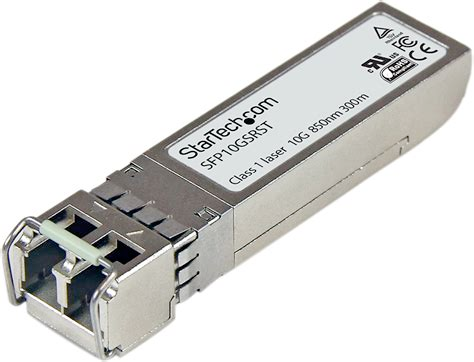

# Übung Optische Übertragung - Lösungen
## Mono-Mode und Multi-Mode
- Skizziere, wie dieser Mehrwegempfang im Kabel entsteht und wie er mit geeigneten Kabeln vermieden wird.
- Skizzieren den Einfluss mit einem Augendiagramm.

## Dämpfung und Dispersion

- Recherchiere, wie gross die frequenzunabhängige Dämpfung in gängigen Lichtwellenleitern ist.
- Welche Wellenlängen eignen sich für eine optische Übertragung?

- Skizziere den Einfluss auf das Signal mit einem Augendiagramm.

## Fallstudie

"Recherchiere, was die Abkürzungen und Fachbegriffe bedeuten und erläutere die Angaben:
Simplex-Singlemode-Kabel als Patchkabel **LC/PC** nach **LC/APC**, kompatibel mit **SFP-Optiken**

- Fiber7 25 Gbit/s: 25G **SFP28** BIDI LR, 10 km, TX1270/RX1330 nm, LC-Simplex, Singlemode
- Fiber7 10 Gbit/s: **10G** **SFP+** **BIDI LR**, 10 km, **TX1270/RX1330 nm**, LC-Simplex, Singlemode
- Crossover7/Hybrid7 (P2P): 1 Gbit Singlefiber SFP Transceiver (10 km/TX1310/RX1490-1550 nm)"

- **Simplex** Eine einzelne Faser für beide Übertragungsrichtungen
- **LC/PC** Weit verbreiteter Steckverbinder für Lichtwellenleiter, Lucent Connector/Physical Contact. Physical Contact bezieht sich auf die Art der Verbindungsoberfläche, welche hier rechtwinklig geschliffen ist.
- **LC/APC** APC steht für Angled Physical Connect, die Verbindungsfläche ist also leicht abgewinkelt. Das reduziert Reflektionen.

- **SFP-Optiken** SFT ist ein Einschubformat bei Switches und Routern, das es ermöglicht, die Optik, also den Umsetzer auf die optische Übertragung, auszutauschen. Es gibt auch verschiedene RJ45 Module und Kabel, die direkt auf SFP Enden.
- **SFP28**, **SFP+** Schnellere Varianten von SFP

- **BIDI LR**, **TX1270/RX1330 nm** Bidirektionale übertragung auf einer Lichtfaser durch zwei verschiedene Wellenlängen, hier 1270nm und 1330 nm. LR steht für long range.
- **Singlemode** Singlemode Kabel
- **10km** maximale Sendedistanz der Optik
- **10G**, **25G** 10 bzw 25Gbit/s Datenübertragungsrate.